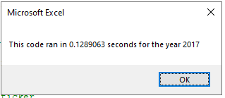
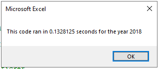

# VBA of Wall Street

## Overview of Project
This project was to analyze the daily volume (total number of shares traded throughout the day) and the yearly return (percentage difference in the share price at the beginning of the year versus the end of the year) on different stocks, for our client, Steve, so he can determine good stocks for his parents to invest in.

I needed to create a readable and user friendly table of results for Steve, using cell formatting and conditional formatting, so Steve can see the results of the entire stock market over the last few years (2017 and 2018).

Finally, I needed to refactor my previous code to run faster for a larger data set.

## Results
### Comparing Stock Performance
Using the following code, inside a `For` loop, I was able to calculate the Total Daily Volume for each stock over each year.
```
'3a) Increase volume for current ticker
    If Cells(i, 1).Value = tickers(tickerIndex) Then
        'increase totalVolume if ticker is ticker(tickerIndex)
        tickerVolumes(tickerIndex) = tickerVolumes(tickerIndex) + Cells(i, 8).Value
    End If
```
These numbers are populated in the Total Daily Volume columns in the following two images for 2017 and 2018.


We can see in the that there is a wide range in the change in volume for each stock between 2017 and 2018, so it's a little easier to tell performance using the yearly return rate.

I used the following code to determine the Yearly Return rate for each stock over the years.

```
'3b) Check if the current row is the first row with the selected tickerIndex.
    If Cells(i, 1).Value = tickers(tickerIndex) And Cells(i - 1, 1).Value <> tickers(tickerIndex) Then
        'assign tickerStartingPrices to the first ticker(tickerIndex)
        tickerStartingPrices(tickerIndex) = Cells(i, 6).Value

'3c) check if the current row is the last row with the selected ticker
    'If the next row s ticker doesn't match, increase the tickerIndex.
    ElseIf Cells(i, 1).Value = tickers(tickerIndex) And Cells(i + 1, 1).Value <> tickers(tickerIndex) Then
        'assign tickerEndingPrices to the last ticker(tickerIndex)
        tickerEndingPrices(tickerIndex) = Cells(i, 6).Value
```

These numbers are populated in the Return columns in the previous images.

Here we can see that in the year 2017, almost all stocks had positive growth, with the highest growth being DQ at 199.4%. Alternatively, in 2018, almost all stocks had negative growth, with the most extreme being DQ at -62.6%.

From this information, we could conclude that most of these stocks are volatile (at least based on the Daily Volume and Yearly Return), although it is hard to make a conclusion on trend just using two years of data.

### Comparing Execution Times

I was able to refactor my original code using arrays, to minimize the amount of times the code was looping through the data.

Using the Timer function, I could see that my run time for my original VBA script was: 0.8398438 seconds for 2017 and 0.84375 seconds for 2018. I was able to get that down to 0.1289063 seconds for 2017 and 0.1328125 seconds for 2018 by refactoring the code.




## Summary
### Advantages and Disadvantages of Refactoring Code
The main disadvantage to refactoring code that I can see is taking the additional time to do it. Technically the code is working, and if you are on a time crunch, it may not seem worth it to spend the extra time going through and changing it when it already works. However, if you can manage to make the code more efficient and easy to use, you will likely save time in the future, have happier clients/customers/supervisors, and possibly learn some new ways to code.

### Application
At first, I couldn't think of how I was supposed to make the original VBA code more efficient using the small number of tools we had learned so far. This meant that without the guidance from the challenge, it would have likely taken me a while to figure out that using arrays would save time. If I had been up against the clock for turning the project in, that may have been an issue for me.

However, I was able to get it to be more efficient using the arrays, and this meant that Steve, the client, could run the analysis faster with more data. I also now know that arrays are more efficient and that I can use them in the future as a way to save time running the code.
